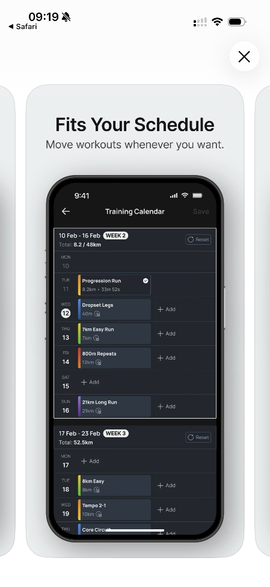
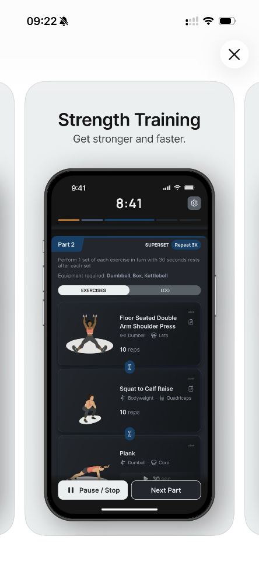

**PREDSTAVITEV SKUPINE**

  --------------------------------------------------------------------------------
  **Naziv skupine**         FitnessBuddy          
  ------------------------- --------------------- --------------------------------
  Ime:                      Ana                   e-mail:
                                                  ana.gjorcheska@student.um.si

  Priimek:                  Gjorcheska            

  Ime:                      Sladjana              e-mail:
                                                  sladjana.peković@student.um.si

  Priimek:                  Peković               

  Ime:                      Marko                 e-mail:
                                                  marko.spasovski1@student.um.si

  Priimek:                  Spasovski             

  **Področje vaših ključnih Naša ekipa ima        
  kompetenc:**              osnovna znanja s      
                            področja spletnega    
                            razvoja, ter backend  
                            tehnologij in baz     
                            podatkov. Imamo tudi  
                            izkušnje z razvojem   
                            projektov v okviru    
                            študija in delom v    
                            skupini. To nam       
                            omogoča uspešno       
                            izvedbo predlagane    
                            aplikacije.           

  **Vaša izobrazba                                
  (formalna in neformalna                         
  izobrazba, če jo                                
  imate):**                                       

  **Izkušnje predstavnikov                        
  skupine:**\                                     
  (opišite svoje                                  
  izobrazbene/delovne                             
  izkušnje, itd., predvsem                        
  tisto, kar se navezuje na                       
  razvoj mobilne                                  
  aplikacije):                                    

                                                  
  --------------------------------------------------------------------------------

**Predstavitev ideje**

+---------------+------------------------------------------------------+
| Na kratko     | Predlagana rešitev je progresivna spletna aplikacija |
| predstavite   | Fitness Buddy, ki uporabnikom omogoča spremljanje    |
| **bistvo vaše | telesne aktivnosti, prehranskih navad in splošnega   |
| ideje** za    | življenjskega sloga v eni platformi. Aplikacija      |
| namizno       | združuje funkcionalnosti beleženja treningov,        |
| rešitev in    | opomnikov za zdrave navade (npr. hidracija, obroki)  |
| povzemite     | ter analize napredka, pri čemer deluje tudi brez     |
| **glavne      | internetne povezave.                                 |
| sestavine**,  |                                                      |
| in sicer:     | Glavna vrednost za uporabnika je v tem, da na        |
|               | enostaven in pregleden način spremlja svojo          |
| \- Jasna      | aktivnost ter prejema prilagojene predloge za        |
| vrednost za   | izboljšanje življenjskega sloga. Aplikacija je       |
| uporabnike    | posebej primerna za študente in mlade, ki pogosto    |
|               | nimajo strukturiranega urnika, hkrati pa je uporabna |
| \- Dovolj     | tudi za vse starostne skupine, ki si želijo bolj     |
| veliko        | zdravega načina življenja.                           |
| potencialno   |                                                      |
| tržišče       | Potencialno tržišče je zelo široko, saj vključuje    |
|               | vse, ki se ukvarjajo z rekreacijo, fitnesom ali      |
| \-            | želijo izboljšati svoje zdravje.                     |
| Pan           |                                                      |
| oga/dejavnost | Aplikacija sodi v panogo digitalnega zdravja in      |
| kamor sodi    | mobilnih aplikacij za življenjski slog.              |
| aplikacija    |                                                      |
|               | Inovativnost ideje temelji na celostnem pristopu, ki |
| \-            | združuje spremljanje treningov, razvoj zdravih navad |
| Inovativnost  | in prehranske opomnike v enotno rešitev, podprto s   |
| ideje         | progresivnimi spletnimi tehnologijami, ki omogočajo  |
|               | zanesljivo delovanje tudi brez internetne povezave.  |
| \-            |                                                      |
| Izvedljivost  | Rešitev je izvedljiva z uporabo sodobnih spletnih    |
| in donosnost  | tehnologij (PWA, Node.js, baze podatkov), hkrati pa  |
| ideje.        | ima velik potencial za nadaljnji razvoj v            |
|               | komercialni produkt (npr. uvedba premium             |
| To je tisti   | funkcionalnosti, integracija z nosljivimi napravami  |
| del           | in napredna personalizacija).                        |
| predstavitve, |                                                      |
| ki bo najbolj |                                                      |
| vplival na    |                                                      |
| bralca!       |                                                      |
+===============+======================================================+
+---------------+------------------------------------------------------+

+---------------+------------------------------------------------------+
| Razložite,    | **INOVATIVNOST VAŠE IDEJE.**                         |
| zakaj menite, |                                                      |
| da boste z    | Inovativnost aplikacije Fitness Buddy temelji        |
| vašo          | predvsem na združevanju več funkcionalnosti v enoten |
| aplikacijo    | sistem. Večina obstoječih rešitev se osredotoča      |
| uspeli na     | bodisi na treninge bodisi na prehrano, medtem ko     |
| trgu in       | Fitness Buddy združuje spremljanje telesne           |
| podprite      | aktivnosti, navad in motivacijskih vzorcev.          |
| svoje trditve |                                                      |
| z argumenti.  | Posebna prednost aplikacije je uporaba t. i.         |
|               | "offline-first" pristopa, kar pomeni, da lahko       |
| **V čem je    | uporabnik beleži treninge in dostopa do podatkov     |
| inovativnost  | tudi brez internetne povezave. To predstavlja        |
| vaše ideje?** | pomembno prednost pred številnimi obstoječimi        |
|               | aplikacijami.                                        |
|               |                                                      |
|               | Dodatno inovativnost predstavlja sistem pametnih     |
|               | opomnikov in prilagodljivih predlogov, ki se         |
|               | prilagajajo uporabnikovim navadam (npr. opozorila ob |
|               | neaktivnosti ali predlogi za izboljšanje rutine).    |
|               |                                                      |
|               | Zaradi kombinacije dostopnosti, personalizacije in   |
|               | enostavne uporabe ima aplikacija potencial za uspeh  |
|               | na trgu.                                             |
+===============+======================================================+
+---------------+------------------------------------------------------+

+---------------+------------------------------------------------------+
| Opišite svoj  | **UPORABNA VREDNOST ZA UPORABNIKE.**                 |
| izdelek ali   |                                                      |
| storitev v    | Fitness Buddy je aplikacija, namenjena spremljanju   |
| luči          | telesne aktivnosti in zdravih navad. Uporabniku      |
| **z           | omogoča beleženje treningov, spremljanje časa v      |
| adovoljevanja | fitnesu, nastavitev ciljev ter prejemanje opomnikov  |
| potreb        | za zdravo vedenje (npr. pitje vode, redna vadba).    |
| končnih       |                                                      |
| u             | Aplikacija deluje kot osebni digitalni trener, ki    |
| porabnikov**; | uporabnika spodbuja k bolj aktivnemu življenjskemu   |
| za kaj gre,   | slogu. Posebnost aplikacije je v tem, da združuje    |
| za kaj se     | več funkcij, ki jih uporabniki običajno uporabljajo  |
| uporablja,    | v ločenih aplikacijah. Sočasno tudi omogoča celotna  |
| kako deluje,  | personalizacija in prilagoditev po uporabnikove      |
| v čem se      | želje.                                               |
| razlikuje od  |                                                      |
| konkurenčnih  | V primerjavi s konkurenčnimi rešitvami aplikacija    |
| izdelkov, v   | izstopa po:                                          |
| čem je        |                                                      |
| aplikacija    | -   delovanju brez internetne povezave               |
| edinstvena    |                                                      |
| itd.          | -   celostnem pristopu, saj ne deluje zgolj kot      |
|               |     vodič za treninge, temveč omogoča tudi           |
|               |     spremljanje prehrane in celotnega življenjskega  |
|               |     sloga uporabnika                                 |
|               |                                                      |
|               | -   sistematičnem beleženju in analizi uporabnikovih |
|               |     navad, na podlagi katerih aplikacija generira    |
|               |     prilagojene opomnike in priporočila              |
|               |                                                      |
|               | > Uporabna vrednost aplikacije je predvsem v večji   |
|               | > motivaciji uporabnikov ter boljši organizaciji     |
|               | > njihovega časa in aktivnosti.                      |
+===============+======================================================+
+---------------+------------------------------------------------------+

+---------------+------------------------------------------------------+
| Kdo so        | **OPREDELITEV CILJNEGA TRŽIŠČA iN njeGOVE ZADOSTNE   |
| oziroma bodo  | VELIKOSTI.**                                         |
| glavni        |                                                      |
| kup           | Glavni uporabniki aplikacije so:                     |
| ci/uporabniki |                                                      |
| namizne       | -   študenti                                         |
| aplikacije?   |                                                      |
|               | -   mladi odrasli                                    |
| **Ali je      |                                                      |
| ciljno        | -   rekreativni športniki                            |
| tržišče       |                                                      |
| dovolj        | -   začetniki v fitnesu                              |
| veliko?**     |                                                      |
|               | Gre za zelo široko ciljno skupino, saj se vedno več  |
| S čim lahko   | ljudi zaveda pomena zdravega življenjskega sloga.    |
| svoje trditve | Trg fitness aplikacij globalno raste, kar potrjuje   |
| podprete?     | veliko število uporabnikov obstoječih rešitev.       |
|               |                                                      |
|               | Dodatno je pomembno, da so PWA aplikacije dostopne   |
|               | na različnih napravah brez potrebe po namestitvi iz  |
|               | trgovine, kar še povečuje potencialno bazo           |
|               | uporabnikov.                                         |
|               |                                                      |
|               | Na podlagi teh dejstev lahko zaključimo, da je       |
|               | ciljno tržišče dovolj veliko in primerno za razvoj   |
|               | tovrstne aplikacije.                                 |
+===============+======================================================+
+---------------+------------------------------------------------------+

+---------------+------------------------------------------------------+
| **Opredelite  | **OBSEG NEPOSREDNE IN POSREDNE KonkurencE.**         |
| vaše glavne   |                                                      |
| konkurente**  | Na trgu že obstaja več podobnih aplikacij, kot so:   |
| in razložite, |                                                      |
| zakaj bodo    | -   MyFitnessPal                                     |
| uporabniki    |                                                      |
| raje          | !                                                    |
| uporabljali   | {width="1.6956517935258093in" |
| vašo          | height="2.5018318022747157in"}                       |
| aplikacij! S  | !                                                    |
| čim lahko     | {width="1.5304352580927385in" |
| svoje trditve | height="2.535705380577428in"}                        |
| podprete?     |                                                      |
|               | -   Nike Training Club                               |
| Poiščite      |                                                      |
| konkurenčne   | !                                                    |
| rešitve in    | {width="1.9246303587051619in" |
| jih opišite   | height="2.8in"}!                                     |
| (s slikami    | {width="2.3043482064741907in" |
| zaslonov      | height="2.8139709098862644in"}                       |
| aplikacije)   |                                                      |
|               | -   Fitbod                                           |
|               |                                                      |
|               | {width="1.8956528871391076in" |
|               | height="2.8043635170603674in"}                       |
|               | {width="2.002360017497813in"  |
|               | height="2.8434776902887138in"}                       |
|               |                                                      |
|               | Te aplikacije ponujajo različne funkcionalnosti, kot |
|               | so sledenje prehrani, treningi in načrtovanje vadbe. |
|               | Kljub temu imajo nekatere pomanjkljivosti:           |
|               |                                                      |
|               | -   zahtevajo stalno internetno povezavo             |
|               |                                                      |
|               | -   Ponujajo plan prehrane, ali plan fitnesa, ne pa  |
|               |     celotni sklop na življenskega sloga              |
|               |                                                      |
|               | -   številne napredne funkcionalnosti so dostopne le |
|               |     v plačljivih različicah aplikacij                |
|               |                                                      |
|               | Fitness Buddy se od konkurence razlikuje po:         |
|               |                                                      |
|               | -   enostavni in intuitivni uporabi                  |
|               |                                                      |
|               | -   združevanju več funkcionalnosti v eni aplikaciji |
|               |                                                      |
|               | -   podpori za offline uporabo (PWA)                 |
|               |                                                      |
|               | -   osredotočenosti na navade in motivacijo          |
+===============+======================================================+
+---------------+------------------------------------------------------+

+---------------+------------------------------------------------------+
| **Kako vidite | V prihodnosti se lahko aplikacija razvije v smeri:   |
| razvoj vaše   |                                                      |
| ideje v       | -   integracije z nosljivimi napravami (npr. pametne |
| naslednjih    |     ure)                                             |
| nekaj         |                                                      |
| letih?**      | -   napredne analitike in personalizacije            |
|               |                                                      |
|               | -   družbenih funkcij (primerjava s prijatelji)      |
+===============+======================================================+
+---------------+------------------------------------------------------+
